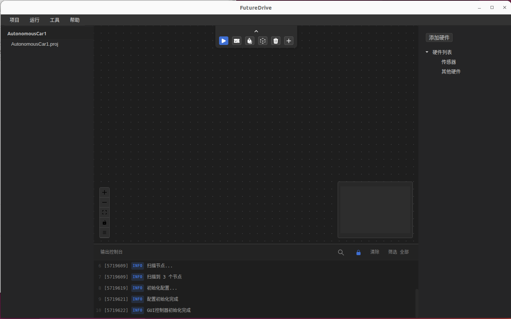
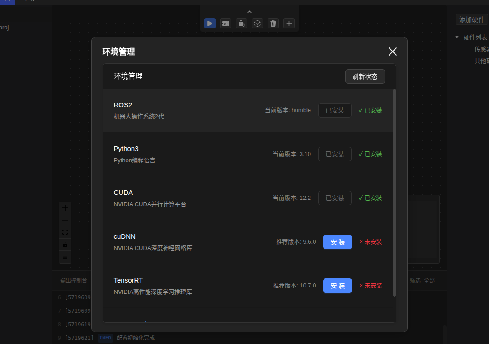
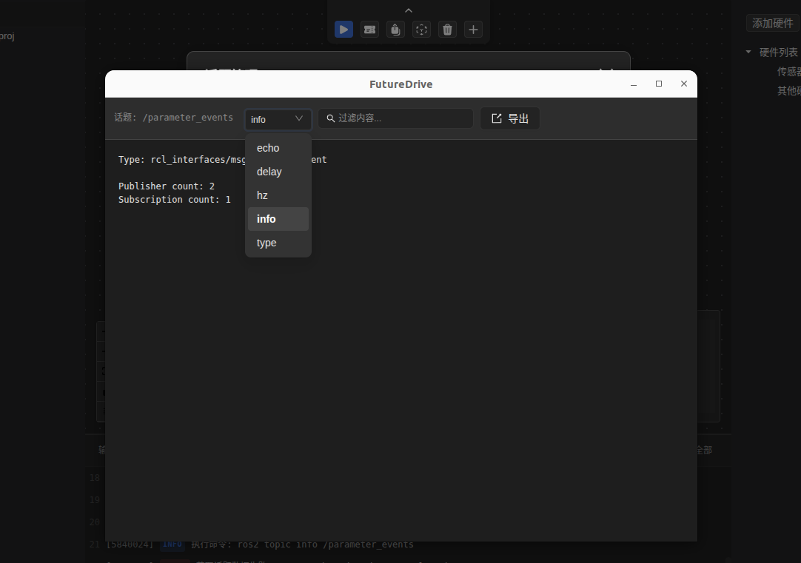
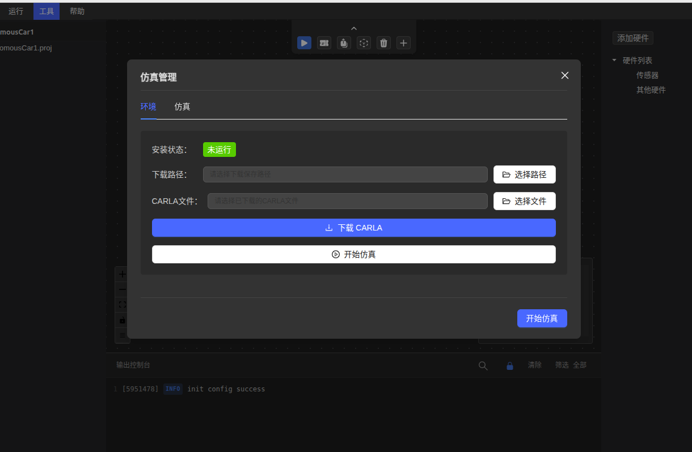

# FutuerDrive

[中文版](README_ZH.md) | English

FutuerDrive is a modular autonomous driving framework offering practical tools, ready-to-use solutions, and a streamlined workflow for fast development and deployment.

## 🎯 Project Goals

FutuerDrive aims to simplify and accelerate autonomous driving development by providing a comprehensive, integrated platform that combines essential tools and workflows into a single, user-friendly environment. Our goal is to reduce development time and complexity while maintaining the flexibility needed for cutting-edge autonomous driving research and deployment.

## 🚀 Core Features

### Autonomous Driving Workflow
- **Streamlined Development Process**: Integrated workflow from concept to deployment
- **Modular Architecture**: Flexible, scalable framework for different use cases
- **Best Practices Integration**: Built-in industry standards and proven methodologies

### Visual Environment Setup
- **One-Click Installation**: Automated environment configuration and dependency management
- **Cross-Platform Support**: Works seamlessly across different operating systems
- **Visual Configuration**: Intuitive GUI for environment setup and management

### Topic Management
- **ROS Topic Integration**: Seamless ROS2 topic management and monitoring
- **Real-time Visualization**: Live topic data visualization and analysis
- **Topic Filtering & Search**: Advanced filtering and search capabilities for efficient topic management

### Vector Map Editor
- **Interactive Map Creation**: Visual map editing with drag-and-drop functionality
- **Lane & Road Network**: Comprehensive road network and lane marking tools
- **Traffic Sign Integration**: Built-in traffic sign and signal management
- **Export Capabilities**: Multiple export formats for different simulation platforms

### Open API
- **RESTful API**: Comprehensive REST API for integration with external systems
- **Plugin Architecture**: Extensible plugin system for custom functionality
- **Third-party Integration**: Easy integration with existing tools and frameworks

### Unified Project Management
- **Project Templates**: Pre-configured templates for common autonomous driving scenarios
- **Version Control**: Integrated version control and project history
- **Collaboration Tools**: Multi-user support and project sharing capabilities

### One-Click Simulation Environment
- **Simulation Setup**: Automated simulation environment configuration
- **Multiple Simulators**: Support for various simulation platforms (Gazebo, CARLA, etc.)
- **Scenario Management**: Pre-built scenarios and custom scenario creation
- **Performance Monitoring**: Real-time performance metrics and analysis

## 🛠️ Technology Stack

- **Frontend**: React.js with Electron for cross-platform desktop application
- **Backend**: Node.js with Python integration for ROS2 support
- **Simulation**: Integration with popular autonomous driving simulators
- **Maps**: Vector-based map editing and management system
- **API**: RESTful API with comprehensive documentation

## 📦 Installation

```bash
# Clone the repository
git clone https://github.com/xautomove/FutureDrive.git

# Navigate to the project directory
cd FutureDrive

# Install yarn (if not installed)
npm install -g yarn

# Install dependencies
yarn install

# Start the application
yarn dev
```

## 🚀 Quick Start

1. **Launch FutuerDrive**: Start the application and create a new project
2. **Environment Setup**: Use the visual environment manager to configure your development environment
3. **Map Creation**: Create or import maps using the vector map editor
4. **Topic Management**: Set up and monitor ROS topics for your autonomous driving system
5. **Simulation**: Configure and run simulations with one-click setup
6. **Development**: Use the integrated workflow tools for efficient development

## 📚 Documentation

- [User Guide](https://futuer.automoves.cn/docs)
- [API Documentation](https://futuer.automoves.cn/docs/api)

## 🤝 Contributing

We welcome contributions from the community! Please see our [Contributing Guidelines](CONTRIBUTING.md) for details on how to submit pull requests, report issues, and contribute to the project.

## 📄 License

This project is licensed under the Creative Commons Attribution-NonCommercial-NoDerivatives 4.0 License - see the [LICENSE](LICENSE) file for details.

## 🙏 Acknowledgments

- ROS community for the robotics framework
- Open source simulation platforms
- Contributors and users of FutuerDrive

## 📞 Support

- **Issues**: [GitHub Issues](https://github.com/xautomove/FutureDrive/issues)
- **Email**: php300@qq.com

---

## 🖼️ Gallery Preview





**FutuerDrive** - Accelerating Autonomous Driving Development
