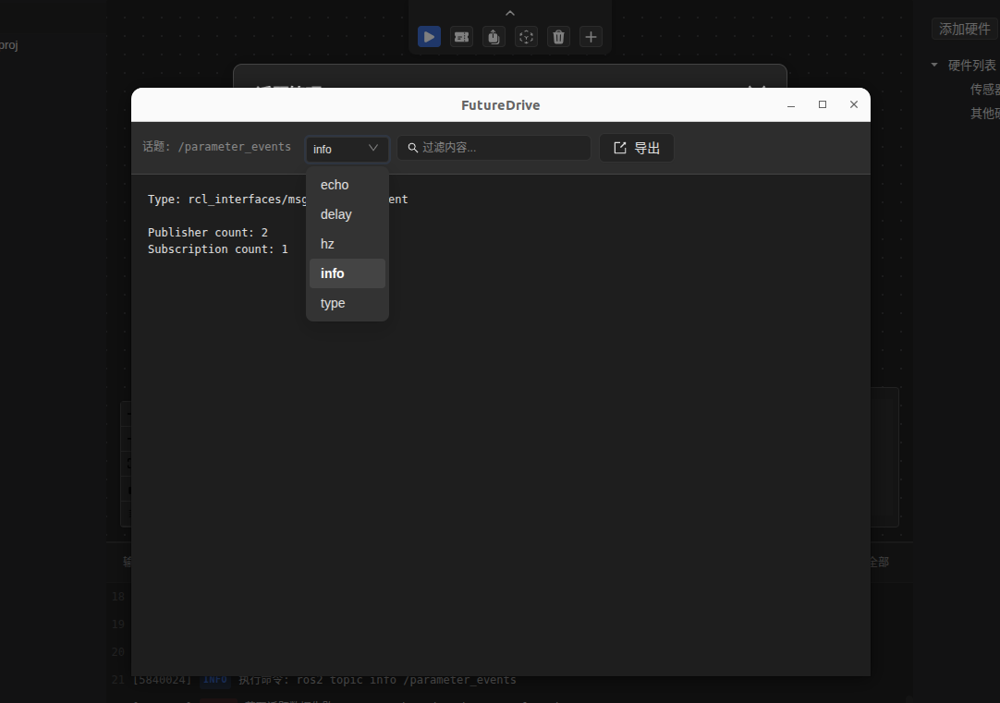

# FutuerDrive

中文 | [English](README.md)

FutuerDrive 是一个模块化自动驾驶框架，提供实用工具、即用型解决方案和简化的工作流程，用于快速开发和部署。

## 🎯 项目目标

FutuerDrive 旨在通过提供全面的集成平台来简化和加速自动驾驶开发，该平台将基本工具和工作流程整合到单一、用户友好的环境中。我们的目标是减少开发时间和复杂性，同时保持前沿自动驾驶研究和部署所需的灵活性。

## 🚀 核心功能

### 自动驾驶工作流
- **简化开发流程**：从概念到部署的集成工作流
- **模块化架构**：灵活、可扩展的框架，适用于不同用例
- **最佳实践集成**：内置行业标准和经过验证的方法论

### 可视化环境安装
- **一键安装**：自动化环境配置和依赖管理
- **跨平台支持**：在不同操作系统间无缝工作
- **可视化配置**：直观的GUI用于环境设置和管理

### 话题管理
- **ROS话题集成**：无缝的ROS2话题管理和监控
- **实时可视化**：实时话题数据可视化和分析
- **话题过滤和搜索**：高级过滤和搜索功能，实现高效的话题管理

### 矢量地图编辑器
- **交互式地图创建**：具有拖放功能的可视化地图编辑
- **车道和道路网络**：全面的道路网络和车道标记工具
- **交通标志集成**：内置交通标志和信号管理
- **导出功能**：多种导出格式，适用于不同仿真平台

### 开放式API
- **RESTful API**：全面的REST API，用于与外部系统集成
- **插件架构**：可扩展的插件系统，支持自定义功能
- **第三方集成**：与现有工具和框架的轻松集成

### 一体化项目管理
- **项目模板**：常见自动驾驶场景的预配置模板
- **版本控制**：集成版本控制和项目历史
- **协作工具**：多用户支持和项目共享功能

### 一键仿真环境
- **仿真设置**：自动化仿真环境配置
- **多仿真器支持**：支持各种仿真平台（Gazebo、CARLA等）
- **场景管理**：预构建场景和自定义场景创建
- **性能监控**：实时性能指标和分析

## 🛠️ 技术栈

- **前端**：React.js 与 Electron 用于跨平台桌面应用
- **后端**：Node.js 与 Python 集成，支持 ROS2
- **仿真**：与流行自动驾驶仿真器集成
- **地图**：基于矢量的地图编辑和管理系统
- **API**：具有全面文档的 RESTful API

## 📦 安装

```bash
# 克隆仓库
git clone https://github.com/xautomove/FutureDrive.git

# 进入项目目录
cd FutureDrive

# 安装 yarn（如未安装）
npm install -g yarn

# 安装依赖
yarn install

# 启动应用
yarn dev
```

## 🚀 快速开始

1. **启动 FutuerDrive**：启动应用并创建新项目
2. **环境设置**：使用可视化环境管理器配置开发环境
3. **地图创建**：使用矢量地图编辑器创建或导入地图
4. **话题管理**：设置和监控自动驾驶系统的ROS话题
5. **仿真**：配置并运行仿真，支持一键设置
6. **开发**：使用集成工作流工具进行高效开发

## 📚 文档

- [用户指南](https://futuer.automoves.cn/docs)
- [API文档](https://futuer.automoves.cn/docs/api)

## 🤝 贡献

我们欢迎社区贡献！请查看我们的[贡献指南](CONTRIBUTING.md)了解如何提交拉取请求、报告问题和为项目做出贡献。

## 📄 许可证

本项目采用 Creative Commons Attribution-NonCommercial-NoDerivatives 4.0 许可证 - 详情请参阅 [LICENSE](LICENSE) 文件。

## 🙏 致谢

- ROS 社区提供的机器人框架
- 开源仿真平台
- FutuerDrive 的贡献者和用户

## 📞 支持

- **问题反馈**：[GitHub Issues](https://github.com/xautomove/FutureDrive/issues)
- **邮箱**：php300@qq.com
---

## 🖼️ 部分预览





**FutuerDrive** - 加速自动驾驶开发 